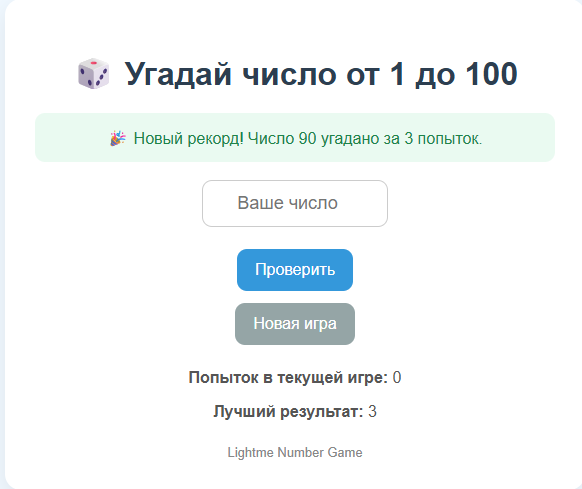
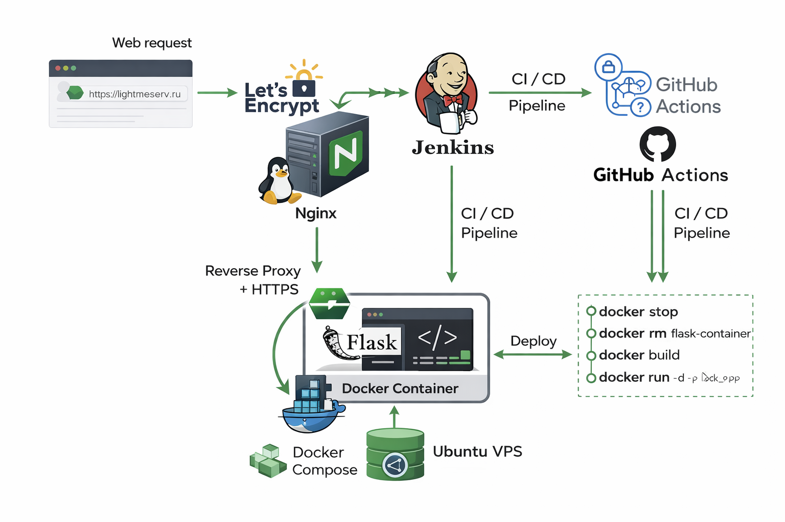

DevOps Flask App 🚀

Production-like DevOps project demonstrating end-to-end deployment of a Python web application using Docker, Jenkins, GitHub Actions, Nginx, and HTTPS.

 
 
 
 


## Live Demo

https://lightmeserv.ru

## Overview

This project demonstrates a complete DevOps workflow:

- developing a Flask web application
- containerizing the application with Docker
- configuring CI/CD with GitHub Actions
- configuring CI/CD with Jenkins Pipeline as Code
- deploying the application to an Ubuntu VPS
- exposing the service through Nginx reverse proxy
- enabling HTTPS with Let's Encrypt

## 📸 Screenshots

### 🌐 Application
<p align="center">
  
</p>

## Architecture
<p align="center">

</p>


📁 Project Structure
.
├── .github/workflows/
│ ├── ci.yml
│ └── cd.yml
├── templates/
│ └── index.html
├── app.py
├── Dockerfile
├── Jenkinsfile
├── requirements.txt
├── .gitignore
└── README.md

## 🔄 CI/CD Pipeline

### Jenkins Pipeline
- Clones repository from GitHub  
- Builds Docker image  
- Stops old container  
- Deploys updated container  
- Verifies container status  

### GitHub Actions
- Triggered on push  
- Builds application  
- Deploys to VPS automatically  

---

## 🐳 Docker

### Build image
```bash
docker build -t my-flask-app .

docker run -d -p 5000:5000 --restart always --name flask-container \
  -e APP_NAME="Lightme Number Game" \
  -e APP_ENV="production" \
  -e SECRET_KEY="change-this-secret-key" \
  my-flask-app


🌍 Deployment
Ubuntu VPS
Nginx as reverse proxy
Domain: lightmeserv.ru
HTTPS enabled via Let's Encrypt

curl https://lightmeserv.ru/health

🧠 What I practiced
Linux server administration
Docker containerization
CI/CD pipelines (Jenkins & GitHub Actions)
Reverse proxy configuration (Nginx)
HTTPS setup with Certbot
Automated deployment
Working with VPS and SSH

